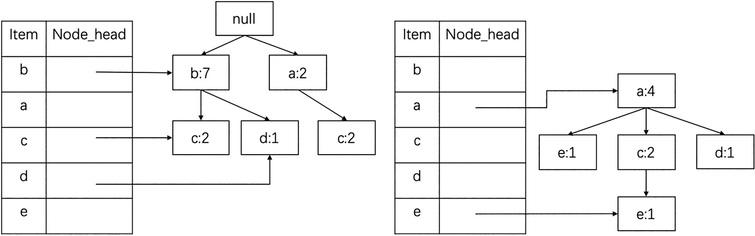

# FP Growth
This project is a simple Python implementation of the FP-Grwoth algorithm used for knowledge discovery in 
databases. I implemented this as a learning example for recursive tree algorithms.

You can find the used example [here](https://www.mygreatlearning.com/blog/understanding-fp-growth-algorithm/).

Cheers, Lucas.

# Usage
Just install the requirements using pip (or any other package management tool):

`pip -r install requirements.txt`

Just run the file with:

`python FpGrowth.py`

to see an example from the previously mentioned website.

# Testing
One can compare the package given in this repo with the 
[mlxtend implementation](http://rasbt.github.io/mlxtend/user_guide/frequent_patterns/fpgrowth/). In order to
run the prebuild tests one can install the requirements in the test repository with:

`pip -r install test\requirements.txt`

and then run:

`python test\Test_FpGrwoth.py`

You can also introduce your own tests by using the `test_own_algorithm` function in the source of the
[test file](test/TestFpGrowth.py).

